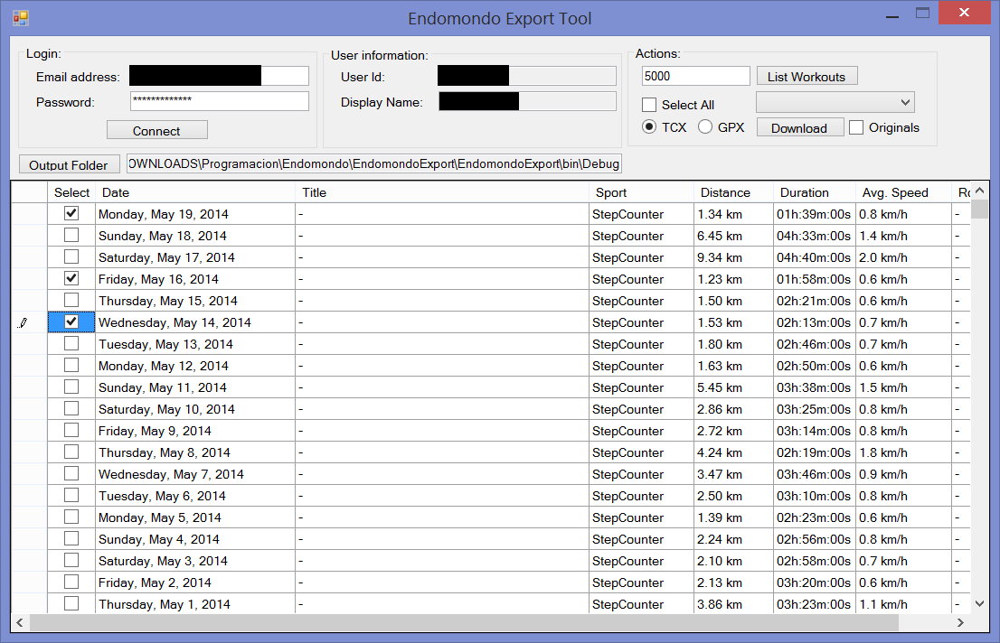

# **CodePlex is shutting down!**

<
As you may already know, after all these amazing years CodePlex is going to stop working, so I've decided to move the binaries over to [my blog](http://blog.gamosoft.com/) to be downloaded from now on. Please use [this direct link to the project](http://blog.gamosoft.com/endomondo-export/) to update your bookmarks.
I'll probably put the code elsewhere but for the moment my blog is where you can keep updated of what's going on with the project (or ask questions, etc...). The project will still remain in Codeplex until the site is closed but will no longer be updated.

Thanks for these years CodePlex!!!

**Project Description**
Endomondo GPX TCX activity exporter / downloader

If you use [Endomondo](http://www.endomondo.com) great service to track your workouts you'll soon realize of a very (IMHO) disappointing feature (or lack of): the ability to export all your information at once. Unfortunately, even though this a request highly demanded by Endomondo's users, they have no plans to implement it, as stated here:

[https://getsatisfaction.com/endomondo/topics/how_do_i_export_all_of_my_workouts_at_one](https://getsatisfaction.com/endomondo/topics/how_do_i_export_all_of_my_workouts_at_one)
_Hi guys, there is unfortunately no way how to export/import (from the file) more than one workout at once and we do not plan to implement it._

There are several options around to be able to do this (sort of) including 3rd party apps and scripts, but I found myself in the need of creating something so it's slightly easier to use for everyone. I've built this very simple Windows forms application that does this, and I'm also providing the code for everyone to peek at it and do whatever they want (maybe port it to a Linux app?).

I initially built it for myself, looking at some other places around to try to get some information, and looking into Fiddler to see what was going on, and I thought maybe someone else could find it useful, so you're absolutely free to download it, and do whatever you want to do with the code if you wish, which BTW is provided as-is. ;-)

< If you find it useful and have spare time you can drop me a line saying how you like the tool and such, or better yet, you can buy me a beer if you wish. ;-) 

Before unzipping the file please "unblock" it (right-click -> properties -> unblock) to avoid issues when executing.

**How does it work?**
The application couldn't be simpler, you just need to type in your email address and password into the provided textboxes and hit the **connect** button.

After the application has connected, you can get a list of the last X workouts (by default 10, I suggest you start with 10 or 20 to test it works for you and then increase the number) which will be shown in the grid below (similarly as how they appear in Endomondo's history view):

Once that is done, simply check the ones you want to download, choose a folder to save them, select the format (either TCX or GPX) and you're done! :-)

You can check all the items of a specific type from the dropdown:

Since this is my own interpretation of Endomondo's data into GPX/TCX formats based on the scarce information around that Endomondo has, the resulting file might not be 100% accurate, there might be missing data which I'm unaware of, maybe using different sports it gets additional data somehow (?). For example, I'm not including heart rate information in the GPX format (although I am in TCX) because I simply didn't have time to add it, but will probably work on that later.

For this, you can also download the "original" data provided by Endomondo if you mark the **Originals** checkbox, which will be saved with the same name as the GPX/TCX file with **.TXT extension, in case you want to mess around with that yourselves. ;-)

Also, I'm not very sure of all the API possibilities (didn't have much time to explore) so for now the tool only downloads the last X activities, there's no possibility to choose a date range, etc.
BTW, the dropdown to select the workout type will check/uncheck the items in the grid. I might change this but for the moment I think it's ok.

One last thing, for activities other than running or biking, tracks are not generated, so in the example above with the pedometer tracking list, those GPX/TCX will not have any correspoding track.
Currently there are no error handling blocks, and sometimes if you request too many activities from Endomondo you'll end up with a 403 error. I implemented a workaround by adding an additional delay of 0.5s between each download, but again your results may vary, so you can download the code and experiment yourself if you wish (or I might implement some kind of hack if I have time).

Remember, this was part of a personal project and I may be extending these functionalities or not depending on my availability, so use it at your own risk.

I hope you guys like it too. :-)
Kind regards.

**Other projects**
Here are other projects you might be interested in as well:

* [http://outlook2013addin.codeplex.com](http://outlook2013addin.codeplex.com)
* [http://entlibextensions.codeplex.com](http://entlibextensions.codeplex.com)
* [http://fiddlertreeviewpanel.codeplex.com](http://fiddlertreeviewpanel.codeplex.com)
* [http://slbindabledatagrid.codeplex.com](http://slbindabledatagrid.codeplex.com)
* [http://sharepointdocgen.codeplex.com](http://sharepointdocgen.codeplex.com)